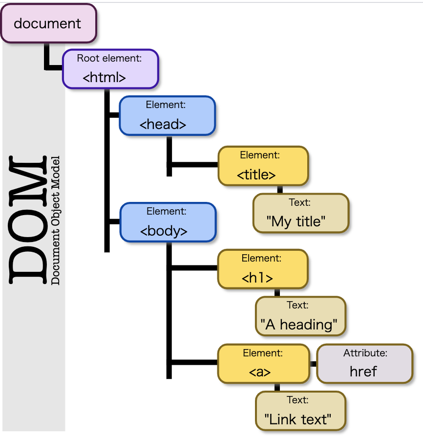
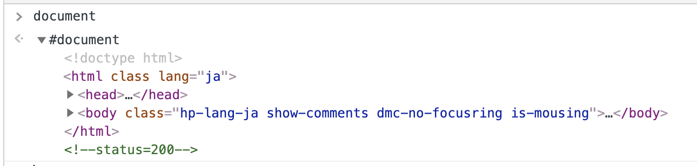

#### 【DOM】
- Document Object Model：　Web上の文章コンテンツと構造からなるオブジェクトのデータ構造
  - Document Object Model (DOM) は HTML や XML 文書のためのプログラミングインターフェイス
 
 #### ★ DOM操作 = JavaScriptでHTMLを書き換えること
 - Webページの内容をいとも簡単に改竄出来る。
 
 #### DOMはツリー構造で表現される
 - ツリー構造: 親子のように辿っていける構造。
 
```
<!DOCTYPE html>
 <html lang="en">
 <head>
 	<title>My title</title>
 </head>
 <body>
    <h1>A heading</h1>
    <a href="">Link text</a>
 </body>
 </html>
```
 
 
 
 #### 実践問題：HTMLをオブジェクトとして表現（=モデリング）してみよう。
 ```html
<html>
  <head>
    <title>Page Title</title>
  </head>
  <body id="top">
    <h1>This is a Heading</h1>
    <p class="main my-class">This is a paragraph.</p>
  </body>
</html>
```
- HTMLをオブジェクト形式で表現する。
```javascript
var my_html = {
    head: {title: "Page Title"},
    body: {
            id: "top", 
            h1: {text: "This is a Heading"},
            p: {text: "This is a paragraph.", classes: ['main', 'my-class']}
     }
}
// cosoleで実行してみる
console.log(my_html.body.h1);
console.log(my_html.body.p.text);
console.log(my_html.body.p.classes);
```

#### 実際にDOM操作してみよう
1. ステップ　　
スタバのページを開く https://product.starbucks.co.jp/goods/?nid=mm

2. スタバのページのコンソールでJavaScriptを実行する（スタバのページの商品を全て取得し、置き換える。
```javascript
// 商品の画像リストを取得
var images = document.getElementsByTagName('img');
for(var n = 0; n < images.length; n++) {
    images[n].src = "https://news.walkerplus.com/article/205022/1259246_615.jpg";
}
```

#### getElementsByTagName について調べてみよう
1. コンソールで確認してみよう
```javascript
var images = document.getElementsByTagName('img')
```
2. 変数 `images` に何が入っているか、コンソールで確認してみよう。
```javascript
console.log(images) // HTMLCollection
```

#### documentオブジェクト
- documentオブジェクトには、HTMLのデータが入っている
 
 
### まとめ
- DOMを操作すると、JavaScriptでHTMLを動的に書き換えられる。

#### 【課題】  
1. いろんなサイトからデータをDOM操作で取得できないか試してみましょう。  
- MDNの課題をやる。　　https://developer.mozilla.org/ja/docs/Learn/JavaScript/Client-side_web_APIs/Manipulating_documents


2. documentオブジェクトが持つ下記三つのプロパティの役割を、MDNで調べて使ってみましょう。  
-  **getElementById**  
IDを指定して要素を取得する `Element` と単数形になっていることに注意

【参考】  
https://developer.mozilla.org/ja/docs/Web/API/Document/getElementById  
1. id プロパティが指定された文字列に一致する要素を表す Element オブジェクトを返す。
2. もし指定された id を持つ要素がなければ、この関数は null を返す
3. 引数で指定するidは大文字小文字を区別する。

例：sample.html
```html
<!DOCTYPE html>
<html lang="en">
<head>
	<meta charset="UTF-8">
	<title>DOM Practice</title>
</head>
<body id="test">
	<h1>JavaScriptテスト</h1>
	<p>10日目の練習問題です。</p>
	<script>
		var body1 = document.getElementById("test");
        var body2 = document.getElementById("TEST");
		console.log(body1); // body要素<body>~</body>が取得できる
        console.log(body2); // null
	</script>
</body>
</html>
```
-  **getElementsByTagName**  
タグの名前を指定して要素を取得する `Elements` と複数形であることに注意  

【参考】  
https://developer.mozilla.org/ja/docs/Web/API/Document/getElementsByTagName
1. 指定されたタグ名を持つ要素の HTMLCollection:オブジェクトの配列を返す
※ HTMLCollection: HTMLCollectionは、HTML要素の集合を表すオブジェクト。インデックス番号でアクセスできる。  
2. document.getElementsByTagName() を再度呼び出さなくても DOM ツリーと同期を取り続ける

例：sample.html
```html
<!DOCTYPE html>
<html lang="en">
<head>
	<meta charset="UTF-8">
	<title>DOM Practice</title>
</head>
<body id="test">
	<h1>JavaScriptテスト</h1>
	<p>10日目の練習問題です。</p>
	<script>
		var body1 = document.getElementsByTagName("h1");
        var body2 = document.getElementsByTagName("p");
		console.log(body1); // HTMLCollection(1)
        console.log(body2); // HTMLCollection(1)
	</script>
</body>
</html>
```

-  **getElementsByClassName**  
クラスの名前を指定して要素を取得する `Elements` と複数形であることに注意  

【参考】  
https://developer.mozilla.org/ja/docs/Web/API/Document/getElementsByClassName
1. 定されたクラス名をすべて持つすべての子要素の配列風オブジェクトを返す。
※ getElementsByTagNameと同じで、「HTMLCollection」が返却される。

例：sample.html
```html
<!DOCTYPE html>
<html lang="en">
<head>
	<meta charset="UTF-8">
	<title>DOM Practice</title>
</head>
<body id="test">
	<h1>JavaScriptテスト</h1>
	<p class="test-class">10日目の練習問題です。</p>
	<script>
        var body1 = document.getElementsByClassName("test-class");
        console.log(body1); // HTMLCollection [p.test-class]
	</script>
</body>
</html>
```
